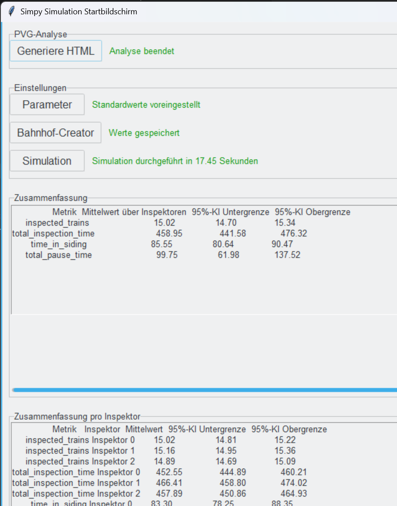
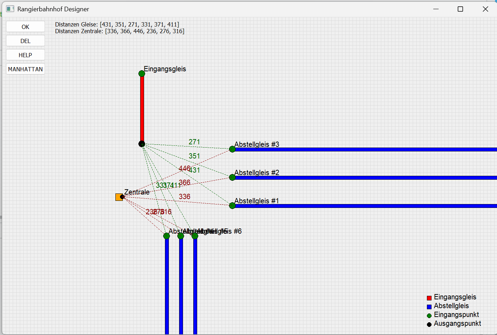
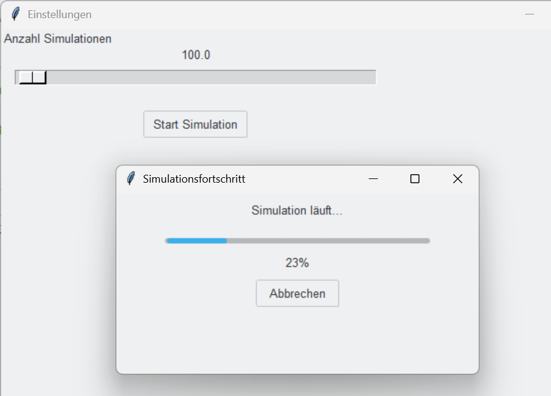
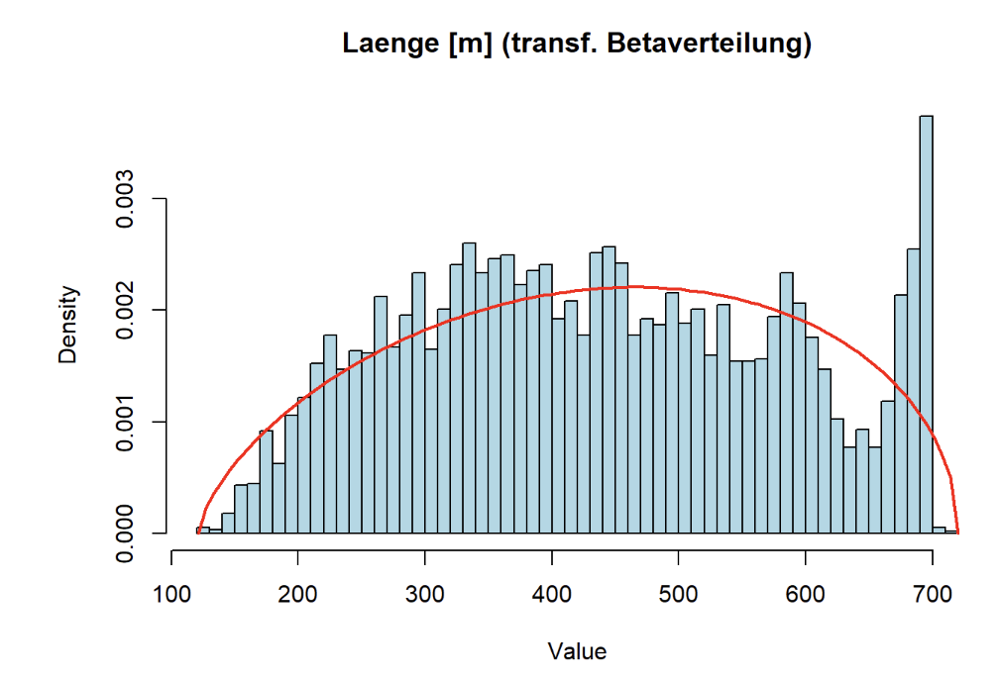
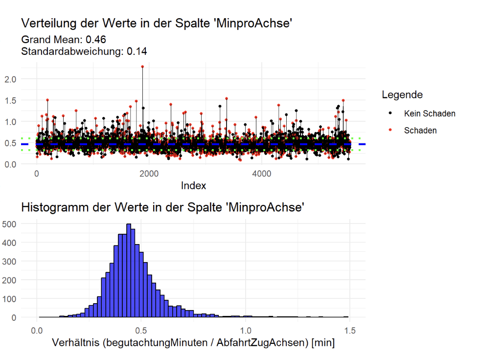

# ASAG-Simulation

Ereignisdiskrete Simulation der **technischen Wagenbehandlung (TWB)** von Güterzügen: Züge treffen in einem Rangierbahnhof ein, werden optional von einer **KI vorgeprüft** und anschließend von menschlichen **Wagenmeistern** begutachtet. Die Simulation dient der Bewertung eines hybriden Inspektionssystems (Mensch + KI) hinsichtlich Effizienz, Zuverlässigkeit und Ressourcenauslastung — z. B. unter Variation von KI-Fehlerraten, Personalstärke und Bahnhofsinfrastruktur.

Die Simulationsparameter sind empirisch fundiert: Eine begleitende R-Auswertung (`r_code/PVG_analysis.Rmd`) analysiert reale PVG-Daten (Schadeinträge der Wagenmeister) und liefert u. a. Begutachtungszeiten pro Achse sowie Zugankunftsverteilungen pro Wochentag.

> Eine detaillierte Beschreibung der Komponenten und ihrer Abhängigkeiten findet sich in [architecture.md](architecture.md).

## Projektstruktur

```
AsagSimulation/
├── py_code/
│   ├── Startscreen.py        # Haupt-GUI (Tkinter): Parametrierung, Simulationssteuerung, Auswertung
│   ├── UI_1.py               # "Bahnhof-Creator" (PyQt5): Gleislayout-Designer, berechnet Distanzen
│   └── main.py               # SimPy-Simulationskern (auch standalone lauffähig)
├── json_files/
│   └── simulation_data.json  # Zentrale Parameterdatei (wird von den GUIs geschrieben, von main.py gelesen)
├── r_code/
│   ├── PVG_analysis.Rmd      # R-Markdown-Auswertung realer PVG-Daten
│   ├── PVG_analysis.html     # Gerendertes Analyse-Ergebnis (lokal, NICHT versioniert — enthält reale Daten)
│   └── r_input.json          # Übergabeparameter an die R-Analyse (Datensatz-Auswahl)
├── analysis_results/         # (wird zur Laufzeit benötigt, siehe Installation)
│   └── simulation_ergebnisse.xlsx
├── docs/
│   └── screenshots/          # Screenshots für die Dokumentation
└── requirements.txt          # Python-Abhängigkeiten (UTF-16-kodiert)
```

## Voraussetzungen

**Python** (Simulation und GUIs):

- Python 3.10 – 3.13 (empfohlen: 3.12). **Python 3.14 funktioniert nicht** mit den gepinnten Paketversionen (`numpy 2.2.2`, `pandas 2.2.3`, `scipy 1.15.3` liefern keine Wheels für 3.14).
- Pakete laut `requirements.txt`: `simpy`, `numpy`, `scipy`, `pandas`, `openpyxl`, `PyQt5`, `ttkthemes` u. a.

**R** (nur für die PVG-Analyse, optional):

- R ≥ 4.5 mit `rmarkdown` und Pandoc (z. B. über RStudio)
- Die benötigten R-Pakete (`fitdistrplus`, `dplyr`, `ggplot2`, `mixtools`, `arrow`, `plotly`, …) installiert das Skript bei Bedarf selbst.
- **Die PVG-Rohdaten (CSV/Parquet) sind nicht Teil des Repositories** und werden über absolute Pfade eingelesen (siehe „Bekannte Einschränkungen“).

## Installation

```bash
# Windows (Python 3.12 über den py-Launcher):
py -3.12 -m venv .venv
.venv\Scripts\activate
pip install -r requirements.txt

# Ausgabeverzeichnis für die Excel-Auswertung anlegen (nicht im Repo enthalten):
mkdir analysis_results
```

## Nutzung

### Gesamtworkflow über die GUI

Vom **Projektstammverzeichnis** aus starten (wichtig, da relative Pfade verwendet werden):

```bash
python py_code/Startscreen.py
```

<p align="center">
  <br>
  <em>Startbildschirm nach einer Simulationskampagne: Steuerung oben, Ergebnis-Zusammenfassung mit 95-%-Konfidenzintervallen unten</em>
</p>

Typischer Ablauf im Startbildschirm:

1. **Parameter** — öffnet ein Einstellungsfenster mit Schiebereglern (Simulationszeit, Anzahl Wagenmeister, Inspektionszeiten, KI-Fehlerraten, Pausenregelungen, …). „Speichern & Schließen“ schreibt `json_files/simulation_data.json`.
2. **Bahnhof-Creator** — startet den grafischen Gleislayout-Designer (`UI_1.py`). Dort Zentrale, Eingangsgleis und Abstellgleise platzieren; per „OK“ werden die Distanzen (Manhattan oder euklidisch) in `simulation_data.json` ergänzt. Die Anzahl der platzierten Abstellgleise bestimmt die Anzahl der Abstellgleise in der Simulation.

   <p align="center">
     <br>
     <em>Bahnhof-Creator: Eingangsgleis (rot), Abstellgleise (blau) und Zentrale (orange) mit automatisch berechneten Distanzen</em>
   </p>

3. **Simulation** — Anzahl der Simulationsläufe wählen und starten. Jeder Lauf führt `main.py` als Subprozess aus; die Ergebnisse werden aggregiert (Mittelwerte, 95-%-Konfidenzintervalle), in der GUI angezeigt und nach `analysis_results/simulation_ergebnisse.xlsx` exportiert.

   <p align="center">
     <br>
     <em>Simulationskampagne mit Fortschrittsanzeige und Abbruchmöglichkeit</em>
   </p>

4. **Generiere HTML** (PVG-Analyse, optional) — wählt einen Datensatz (SEE/BSS/MN/TK), rendert `PVG_analysis.Rmd` über `Rscript` und öffnet den HTML-Bericht im Browser.

   <p align="center">
     
     <br>
     <em>Beispiele aus dem PVG-Analysebericht: Beta-Verteilung der Zuglängen (links) und Begutachtungszeit pro Achse (rechts) — diese empirischen Schätzungen fundieren die Simulationsparameter</em>
   </p>

### Einzelne Simulation ohne GUI

```bash
python py_code/main.py [step_id]
```

Liest die Parameter aus `json_files/simulation_data.json` (fehlende Werte werden durch Code-Defaults ersetzt) und schreibt `results_step_<step_id>.json` in das aktuelle Arbeitsverzeichnis.

## Ergebnisse

Die Excel-Datei `analysis_results/simulation_ergebnisse.xlsx` enthält fünf Blätter:

| Blatt | Inhalt |
|---|---|
| `Simulation_Header` | Verwendete Parameter und Anzahl der Simulationsschritte |
| `Einzelergebnisse_Inspektoren` | Kennzahlen je Wagenmeister (begutachtete Züge, Begutachtungs-, Gleis- und Pausenzeiten) |
| `Zusammenfassung_Inspektoren` | Mittelwerte über alle Wagenmeister inkl. Konfidenzintervallen |
| `ProSimulationsschritt_Züge` | Zug-Kennzahlen je Simulationslauf (Standzeit, Wartezeit, wahre/gefundene Schäden, KI-Fehler, …) |
| `Zusammenfassung_Züge` | Zug-Kennzahlen aggregiert über alle Läufe inkl. Konfidenzintervallen |

## Datenschutz: Reale Auftraggeber-Daten

**Es dürfen keine realen PVG-Daten oder daraus abgeleitete Artefakte in das Repository gelangen.**

- Die Rohdaten (CSV/Parquet) liegen außerhalb des Repos und werden ausschließlich über absolute lokale Pfade gelesen.
- Gerenderte Berichte (`r_code/*.html`) betten die zugrunde liegenden Datenpunkte ein (interaktive plotly-/DT-Elemente, u. a. reale Zugnummern und Tageswerte) und sind daher per `.gitignore` vom Versionieren ausgeschlossen — ebenso `*.csv`, `*.parquet`, `results_step_*.json` und `analysis_results/`.
- Vor jedem Push prüfen: `git status` und `git diff --cached --stat` dürfen keine Daten-Artefakte enthalten.

## Bekannte Einschränkungen

- **Hartkodierte Pfade für die PVG-Analyse:** `Startscreen.py` (`run_rmarkdown`) verwendet absolute Pfade zu `Rscript.exe`, zum Pandoc-Verzeichnis von RStudio und zum Projektpfad (`C:/Users/rough/PycharmProjects/simpy/...`). Ebenso liest `PVG_analysis.Rmd` die Rohdaten von festen Desktop-Pfaden. Für andere Umgebungen müssen diese Pfade angepasst werden.
- **Arbeitsverzeichnis:** Die GUI ruft `py_code/main.py` relativ auf und liest die Ergebnisdateien aus dem aktuellen Verzeichnis — daher immer vom Projektstamm starten.
- **`analysis_results/` muss existieren**, sonst schlägt der Excel-Export fehl (Git versioniert keine leeren Verzeichnisse).
- Einige Parameter sind **nur im Code** einstellbar (nicht über GUI/JSON): `WOCHENTAG` (Ankunftsverteilung), `AI_INSP` (KI-Stufe an/aus), `HUMAN_DESC` (menschliche Begutachtung an/aus), `NUM_WAGONS`, `MEAN_NUM_DAMAGES`, Achsverteilungen.
- Einzelne konfigurierbare Parameter sind derzeit **ohne Wirkung** im Modell (Details in [architecture.md](architecture.md#bekannte-kopplungspunkte-und-fallstricke)): `INSP_TIME_PER_AXES`, `WORKING_DAY` (aus JSON), `REGULAR_PAUSE`.
- `requirements.txt` ist UTF-16-kodiert; `pip` kommt damit zurecht (BOM), manche andere Tools nicht.

## Autoren und Lizenz

Patric Schubert, Marius Lau, Lucija Heun, Christian Haas — © 2025 [CoDive](https://codive.de/).
Version 1.2 (Prototyp). Kontakt: schubert@codive.de
