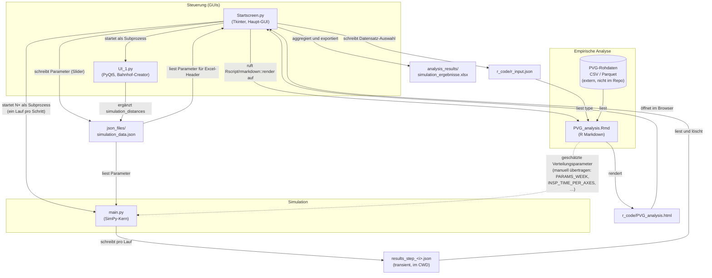
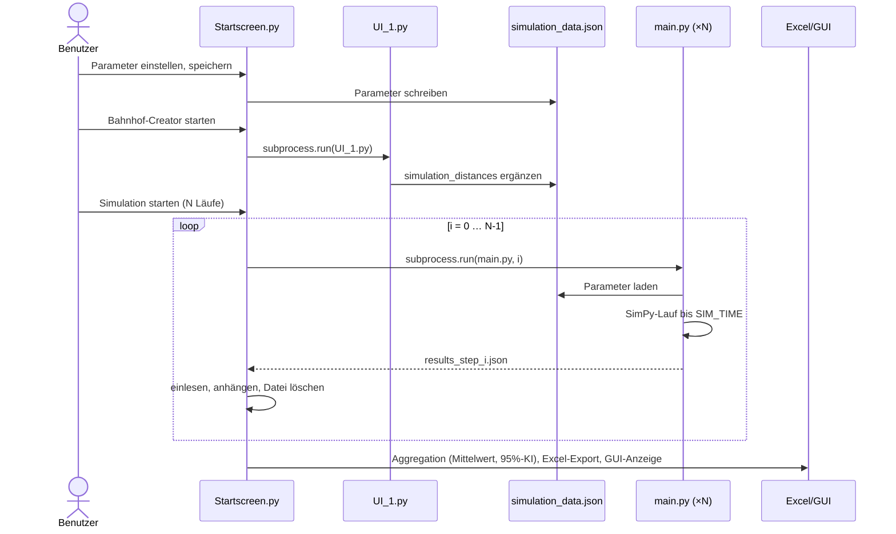

# Architektur

Dieses Dokument beschreibt die Komponenten des Projekts, ihre Schnittstellen und die gegenseitigen Abhängigkeiten.

## Überblick

Das System besteht aus vier aktiven Komponenten und einer Reihe von Datendateien, über die sie gekoppelt sind. Es gibt **keine direkten Python-Imports zwischen den Komponenten** — die Kopplung erfolgt ausschließlich über **Subprozess-Aufrufe** und **Dateien (JSON/Excel/HTML)**.



Die gestrichelte Kante ist eine **konzeptionelle** Abhängigkeit: Die R-Analyse schätzt Verteilungsparameter aus realen Daten, die als Default-Werte **von Hand** in den Code von `main.py` übernommen wurden.

## Komponenten

### 1. `py_code/Startscreen.py` — Haupt-GUI und Orchestrierung (Tkinter/ttkthemes)

Zentrale Drehscheibe des Systems. Aufgaben:

- **Parametrierung:** Einstellungsfenster mit Schiebereglern; „Speichern & Schließen“ serialisiert alle Werte nach `json_files/simulation_data.json`. Dabei wird `simulation_distances` mit einem Default (`{"gleise": [500, 500], "zentrale": [500, 500]}`) überschrieben — der Bahnhof-Creator sollte danach erneut ausgeführt werden.
- **Bahnhof-Creator starten:** Führt `UI_1.py` in einem Thread per `subprocess.run([sys.executable, "UI_1.py"])` aus und schaltet danach den Simulations-Button frei.
- **Simulationskampagne:** Führt `main.py` N-mal als Subprozess aus (`subprocess.run([sys.executable, "py_code/main.py", str(i)])`, daher muss das CWD der Projektstamm sein). Liest nach jedem Lauf `results_step_<i>.json`, hängt die Daten an In-Memory-Listen an und **löscht** die Datei. Anschließend:
  - Aggregation mit `numpy`/`scipy` (Mittelwerte, 95-%-Konfidenzintervalle via t-Verteilung; bei nur einem Lauf entfallen die Intervalle),
  - Export als formatierte Excel-Datei (`pandas` + `openpyxl`) nach `analysis_results/simulation_ergebnisse.xlsx` inkl. Parameter-Header aus `simulation_data.json`,
  - Anzeige der Zusammenfassungen in der GUI.
- **PVG-Analyse anstoßen:** Schreibt die Datensatz-Auswahl (`SEE`/`BSS`/`MN`/`TK`) nach `r_code/r_input.json`, rendert `PVG_analysis.Rmd` über `Rscript.exe` (hartkodierte Pfade!) und öffnet das erzeugte HTML im Browser.

### 2. `py_code/UI_1.py` — „YardDesigner“ / Bahnhof-Creator (PyQt5)

Grafischer Editor für das Gleislayout auf einem Raster-Canvas:

- Platzieren, Verschieben, Drehen und Löschen von **Zentrale**, **Eingangsgleis** und beliebig vielen **Abstellgleisen**.
- Berechnet Distanzen (wahlweise **Manhattan** oder **euklidisch**):
  - vom Ausgangspunkt des Eingangsgleises zum Eingangspunkt jedes Abstellgleises (`gleise`),
  - von der Zentrale zum Eingangspunkt jedes Abstellgleises (`zentrale`).
- „OK“ lädt `simulation_data.json`, ergänzt/ersetzt den Schlüssel `simulation_distances` und schreibt die Datei zurück. **Die Länge der Liste `gleise` definiert die Anzahl der Abstellgleise in der Simulation.**

### 3. `py_code/main.py` — Simulationskern (SimPy)

Standalone lauffähiges Skript (`python py_code/main.py [step_id]`). Ablauf:

1. `load_json_params()` — überschreibt die Code-Defaults mit Werten aus `simulation_data.json` (fehlende Schlüssel behalten den Default). Aus `simulation_distances` werden abgeleitet:
   - `ABSTELLGLEISE = len(gleise)`
   - `WALKING_DURATION[i] = zentrale[i] / 180 + 5` (Fußweg Zentrale → Gleis, Minuten)
   - `DRIVING_DURATION[i] = gleise[i] / 360 + 5` (Fahrzeit Einfahrt → Gleis, Minuten)
2. `validiere_eingaben()` — Assertions auf Typen und Wertebereiche aller Parameter.
3. `run_simulation_once(step_id)` — baut die SimPy-Welt auf und simuliert bis `SIM_TIME`:

**Modellstruktur:**

| Element | Umsetzung | Verhalten |
|---|---|---|
| Abstellgleise | `simpy.Resource` (Kapazität 1) je Gleis | Züge werden round-robin zugewiesen (`zug_nummer % ABSTELLGLEISE`) und warten ggf. vor dem Gleis |
| Wagenmeister | `Inspector` mit eigener `simpy.Resource`, Verfügbarkeit über gemeinsamen `simpy.Store` (`InspectorPool`) | Schichtgruppen (`id % NUM_SHIFTS`); `pause_manager`-Prozess: alle 10 min Chance von 5 % auf Kurzpause (3–15 min) und reguläre 30-min-Pause nach 300 + Schichtgruppe·60 Arbeitsminuten |
| KI-Prüfung | `InspectorAI` | False Negatives ~ Binomial(Schäden, `FALSE_NEGATIVE`); False Positives ~ Poisson(`FALSE_POSITIVE`) je Wagen |
| Zugankunft | `zug_generator`-Prozess | Zwischenankunftszeiten aus einer **2-Komponenten-Normalmischung** je Wochentag (`PARAMS_WEEK`, geschätzt aus PVG-Daten durch die R-Analyse) |
| Zug | `Train` mit Prozess `twb()` (technische Wagenbehandlung) | s. u. |

**Ablauf `Train.twb()`:** Gleis anfordern → Einfahrt (`DRIVING_DURATION`) → optionale KI-Prüfung (`AI_INSP`) → Wagenmeister aus Pool holen (`HUMAN_DESC`) → digitale Begutachtung am Bildschirm (normalverteilt pro Wagen) → Umklassifizierungen von KI-Fehlern im PVG-System (abhängig von `HUMAN_INSP_PROB` und `TRUST_AI_PROB`) → bei Inkonsistenzen mit Wahrscheinlichkeit `PROB_INCON_HANDLING` Vor-Ort-Begutachtung: Fußweg ins Gleis, genauere Prüfung, PVG-Änderungen, Rückweg → Formalitäten/Aktenarbeit → Wagenmeister zurück in den Pool → Abfahrt.

Zufallszeiten werden als Summe normalverteilter Einzelzeiten modelliert: `working_time(n, m, s)` zieht aus N(n·m, √n·s) mit Resampling bei nicht-positiven Werten.

4. Ergebnis-Export: `results_step_<step_id>.json` ins **aktuelle Arbeitsverzeichnis**.

### 4. `r_code/PVG_analysis.Rmd` — Empirische Datenanalyse (R Markdown)

Analysiert reale PVG-Einträge (Schadmeldungen der Wagenmeister) und liefert die empirische Grundlage der Simulationsparameter:

- **Input:** `r_input.json` (`{"type": "SEE"|"BSS"|"MN"|"TK"}`) sowie externe Rohdaten (CSV für Seelze, Parquet für die übrigen Bezirke) von **absoluten lokalen Pfaden** — nicht im Repository enthalten.
- **Preprocessing (`CombiData`):** Filterung (ein Wagenmeister, plausible Zuglängen, kein Abbruch), Dubletten-Bereinigung, Zusammenfassung der Wagen-Einträge zu Zügen, Berechnung der Begutachtungsminuten (abzüglich Wegezeit).
- **Analysen/Schätzungen:** Begutachtungszeit pro Achse und pro Meter, Verteilung der Wagenanzahl (Normal) und Zuglänge (Beta), Schadenswahrscheinlichkeit (Weibull), Fourier-Analyse der Zugfrequenz, **Normalmischungs-Schätzung der Zuganzahl je Wochentag (`mixtools::normalmixEM`)**, Schadklassen-Häufigkeiten.
- **Output:** `PVG_analysis.html` (interaktiver Bericht mit plotly/DT).

## Datenschnittstellen (Verträge)

### `json_files/simulation_data.json`

Geschrieben von `Startscreen.py` (komplett) und `UI_1.py` (nur `simulation_distances`), gelesen von `main.py` und `Startscreen.py` (Excel-Header).

```jsonc
{
  "SIM_TIME": 1200,              // Simulationsdauer [min]
  "WORKING_DAY": 1440,           // Bezugszeitraum für Ankunftsraten [min]
  "NUM_INSPECTORS": 3,
  "INSP_TIME_SCREEN_PER_WAGON": 1.0, "SD_INSP_TIME_SCREEN_PER_WAGON": 0.1,
  "INSP_CLOSER_LOOK": 2.0, "SD_INSP_CLOSER_LOOK": 0.3,
  "TIME_PVG": 5.0, "SD_TIME_PVG": 1.0,
  "FORMALITIES_BASELINE": 10.0, "MEAN_NUM_FORMAL_ACTS": 0.2,
  "MEAN_TIME_FORMALS": 20.0, "SD_TIME_FORMALS": 3.0,
  "HUMAN_INSP_PROB": 0.99,       // Trefferquote des Wagenmeisters
  "TRUST_AI_PROB": 0.5,          // Vertrauen in die KI-Entscheidung
  "PROB_INCON_HANDLING": 0.5,    // P(Inkonsistenz erfordert Vor-Ort-Prüfung)
  "SHORT_PAUSE_MIN": 3, "SHORT_PAUSE_MAX": 20,
  "REGULAR_PAUSE": 30, "NUM_SHIFTS": 3,
  "FALSE_NEGATIVE": 0.02, "FALSE_POSITIVE": 0.05,   // KI-Fehlerraten
  "INSP_TIME_PER_AXES": 0.35, "SD_INSP_TIME_PER_AXES": 0.1,
  "simulation_distances": {      // vom Bahnhof-Creator erzeugt
    "gleise":   [481],           // Distanz Einfahrt → Abstellgleis i (Rastereinheiten ≙ Meter)
    "zentrale": [545]            // Distanz Zentrale → Abstellgleis i
  }
}
```

### `results_step_<i>.json` (transient)

Geschrieben von `main.py` ins CWD, von `Startscreen.py` gelesen und gelöscht.

```jsonc
{
  "inspectors": [
    { "id": 0, "inspected_trains": 7, "total_inspection_time": 312.4,
      "time_in_siding": 45.2, "total_pause_time": 60 }
  ],
  "trains": [
    { "zug_id": 1, "arrival": 12.3, "departure": 95.1, "stay_time": 82.8,
      "Fahrzeit": 6.3, "Wartezeit": 0.0,
      "true_damages": 2, "ai_found": 2, "ai_fp": 0, "ai_fn": 0,
      "human_found": 2, "human_fp_umklassifiziert": 0, "human_fn_umklassifiziert": 0 }
  ]
}
```

### `r_code/r_input.json`

Geschrieben von `Startscreen.py`, gelesen vom Rmd (relativ zu `r_code/`, da `rmarkdown::render` das Arbeitsverzeichnis auf das Rmd-Verzeichnis setzt).

```json
{ "type": "MN" }
```

### `analysis_results/simulation_ergebnisse.xlsx`

Endprodukt der Simulationskampagne. Blätter: `Simulation_Header`, `Einzelergebnisse_Inspektoren`, `Zusammenfassung_Inspektoren`, `ProSimulationsschritt_Züge`, `Zusammenfassung_Züge`. In `Startscreen.py` existiert dafür ein Mapping von Anzeige-Metriknamen auf die JSON-Schlüssel der Zugergebnisse (`metric_key_map`, z. B. `time → stay_time`, `waiting_time → Wartezeit`).

## Ablauf einer Simulationskampagne



## Abhängigkeitsmatrix

| Komponente / Artefakt | liest | schreibt | startet |
|---|---|---|---|
| `Startscreen.py` | `results_step_<i>.json`, `simulation_data.json` | `simulation_data.json`, `r_input.json`, `simulation_ergebnisse.xlsx` | `UI_1.py`, `main.py`, `Rscript` (Rmd), Browser (HTML) |
| `UI_1.py` | `simulation_data.json` | `simulation_data.json` (nur `simulation_distances`) | — |
| `main.py` | `simulation_data.json` | `results_step_<i>.json` | — |
| `PVG_analysis.Rmd` | `r_input.json`, externe PVG-Rohdaten | `PVG_analysis.html` | — |

Daraus folgt die Startreihenfolge: **Parameter speichern → Bahnhof-Creator → Simulation.** `main.py` funktioniert auch ohne die GUIs (Code-Defaults bzw. vorhandene JSON), und die R-Analyse ist vollständig optional — sie wird nur zur (Neu-)Schätzung der empirischen Parameter benötigt.

## Kopplung R-Analyse ↔ Simulation

Die R-Analyse ist zur Laufzeit nur lose gekoppelt (über `r_input.json`/HTML), liefert aber die **empirischen Grundlagen**, die als Konstanten in `main.py` eingeflossen sind:

- `PARAMS_WEEK` (Normalmischungs-Parameter `lambda/mu/sigma` je Wochentag für die Zuganzahl) ← Abschnitt „Frequenzierung der Züge pro Tag“ des Rmd.
- `INSP_TIME_PER_AXES = 0.35`, `SD = 0.12` ← Abschnitt „Begutachtungszeit pro Achse“ (im Code als `data source: PVG` markiert).
- Plausibilisierung von `NUM_WAGONS`, `MEAN_NUM_DAMAGES` u. a.

Wird die R-Analyse mit neuen Daten ausgeführt, müssen geänderte Parameter **manuell** in `main.py` (bzw. über die GUI in die JSON) übertragen werden — es gibt keinen automatischen Rückkanal.

## Bekannte Kopplungspunkte und Fallstricke

- **CWD-Annahme:** `Startscreen.py` ruft `py_code/main.py` mit relativem Pfad auf und erwartet `results_step_<i>.json` im CWD → GUI immer vom Projektstamm starten.
- **Hartkodierte Pfade** in `run_rmarkdown()` (`Rscript.exe`, `RSTUDIO_PANDOC`, Projektpfad `C:/Users/rough/PycharmProjects/simpy/...`) und in `load_data()` des Rmd (Rohdaten-Pfade). Diese Pfade sind umgebungsspezifisch.
- **`analysis_results/` wird nicht automatisch angelegt** → Excel-Export schlägt ohne das Verzeichnis fehl.
- **`WORKING_DAY` aus der JSON ist wirkungslos:** Der Wert wird als Default-Argument von `simulate_waiting_times(..., total_time=WORKING_DAY)` bereits beim Import gebunden — `load_json_params()` läuft erst danach, und der Aufruf in `zug_generator` übergibt `total_time` nicht.
- **`INSP_TIME_PER_AXES` / `num_axes` sind derzeit ungenutzt:** Die Achsenzahl je Zug wird berechnet und der Parameter konfiguriert/validiert, die Begutachtungszeit basiert aber ausschließlich auf der Wagenanzahl (`INSP_TIME_SCREEN_PER_WAGON`).
- **`REGULAR_PAUSE` ist konfigurierbar, aber im `pause_manager` mit 30 min hartkodiert;** ebenso nutzt die Kurzpause fest `SHORT_PAUSE_MIN/MAX` aus den Globals (wirksam), die reguläre Pausendauer jedoch nicht.
- **Parallele Schreibzugriffe auf `simulation_data.json`:** `Startscreen.py` überschreibt beim Speichern der Slider auch `simulation_distances` mit Default-Werten — ein zuvor gestalteter Bahnhof geht damit verloren (Reihenfolge beachten).
- **Mehrfachstart möglich:** Wegen des Threadings kann der Simulations-/Creator-Prozess mehrfach parallel gestartet werden (im Code als TODO vermerkt).
