# Ergebnisse der ASAG-Simulationsstudie

Teil der Dokumentation des abgeschlossenen ASAG-Simulationsprojekts.

> Methodik, Versuchsdesign und Modellaufbau sind in [simulationsstudie.md](simulationsstudie.md) beschrieben; die Systemarchitektur und Modulabhängigkeiten in [architecture.md](../architecture.md). Dieses Dokument fasst die **Befunde** der abgeschlossenen Simulationskampagnen zusammen.

Die Studie modelliert einen **hybriden Begutachtungsprozess** im Rangierbahnhof: Eine KI trifft eine optische Vorentscheidung (Pre-Screening), der menschliche Wagenmeister verantwortet die endgültige Entscheidung (Bestätigung, Umklassifizierung oder Neuannotation). Untersucht wurde, wie KI-Güte, Vertrauen in die KI und menschliche Entscheidungsgüte zusammenwirken — einmal unter **stabilen Bedingungen** (Studie 1) und einmal unter **Ressourcenknappheit** (Studie 2).

---

## 1. Überblick und Auswerteebenen

Die Rohdaten aus den Simulationen wurden lokal gespeichert (Zwischenspeicherung in PostgreSQL, Export nach Excel). **Jede Zeile** repräsentiert eine Kombination der unabhängigen Variablen und eine Zielgröße. Enthalten sind:

- **Mean** (Mittelwert),
- **CI Lower** und **CI Upper** (Grenzen des 95-%-Konfidenzintervalls),
- die **Faktorstufen** `HUMAN_INSP_PROB`, `TRUST_AI_PROB` und `AI_COMP`.

Die Daten wurden vor der Analyse bereinigt (Spaltennamen vereinheitlicht, Vollständigkeit geprüft). Die Auswertung erfolgt auf zwei Ebenen:

- **Wagenmeister-Ebene** — Kennzahlen je Wagenmeister (Begutachtungszeit, Gleiszeit, Pausen, Durchsatz).
- **Zug-Ebene** — Kennzahlen je Zug (Standzeit, Wartezeit, wahre/gefundene Schäden, KI-Fehler, Umklassifikationen).

### Lesehilfe für die Plots

Alle Diagramme sind **Fehlerbalkenplots**: Sie zeigen den **Mittelwert ± 95-%-Konfidenzintervall** (asymmetrisch dargestellt).

| Element | Bedeutung |
|---|---|
| **X-Achse** | Stufen von `TRUST_AI_PROB` (Vertrauen in die KI): low → medium → high |
| **Y-Achse** | Mittelwert der jeweiligen Metrik |
| **Linien (Farbe)** | KI-Güte `AI_COMP`: bad = rot, good = blau, near_perfect = grün |
| **Separate Diagramme** | je menschlicher Güte `HUMAN` = high / medium / bad |

Die vollständigen Plot-Sätze liegen in den folgenden Ordnern und dienen als Gesamtquelle der hier gezeigten Auszüge:

- [`ergebnisse/plots_trains/`](ergebnisse/plots_trains/) — Zug-Ebene, Studie 1
- [`ergebnisse/plots_inspectors/`](ergebnisse/plots_inspectors/) — Wagenmeister-Ebene, Studie 1
- [`ergebnisse/plots_trains_highfreq/`](ergebnisse/plots_trains_highfreq/) — Zug-Ebene, Studie 2 (Ressourcenknappheit)
- [`ergebnisse/plots_inspectors_highfreq/`](ergebnisse/plots_inspectors_highfreq/) — Wagenmeister-Ebene, Studie 2

---

## 2. Zielgrößen-Definitionen

### Wagenmeister-Ebene

| Zielgröße | Definition |
|---|---|
| `inspected_trains` | Anzahl der untersuchten Züge (infrastrukturbedingt, ohne Interaktionseffekte) |
| `total_inspection_time` | Zeit für die Inspektion (inkl. digitaler und analoger Begutachtung) |
| `time_in_siding` | Zeit im Gleis (bei Inkonsistenzen zwischen KI- und Wagenmeisterentscheidung) |
| `total_pause_time` | Summe geplanter und ungeplanter Pausen |

### Zug-Ebene

| Zielgröße | Definition |
|---|---|
| `time` | Aufenthaltszeit auf dem Abstellgleis |
| `waiting_time` | Wartezeit ohne Begutachtung |
| `true_damages` | Anzahl der wahren Schäden |
| `true_damages_found_ai` | durch KI erkannte wahre Schäden |
| `false_positives_ai` | fälschlich erkannte Schäden durch KI |
| `false_negatives_ai` | nicht erkannte Schäden durch KI |
| `true_damages_found_human` | nach KI-Vorentscheidung vom Wagenmeister erkannte wahre Schäden |
| `false_positives_umklassifiziert` | vom Wagenmeister korrigierte KI-Falschmeldungen |
| `false_negatives_umklassifiziert` | vom Wagenmeister korrigierte KI-Übersehungen |

---

## 3. Studie 1 — Stabile Bedingungen

**Rahmenbedingungen:** 3 Abstellgleise, 4 Wagenmeister in Schichten, Ressourcen nicht knapp. Die Frequenzierung des Bahnhofs lag bei **M = 54,74 Zügen (SD = 0,87)**. Unter diesen stabilen Bedingungen lassen sich prozessimmanente Effekte (Interaktionen zwischen KI-Güte, Vertrauen und menschlicher Güte) von systemischen Störeinflüssen analytisch trennen.

### 3.1 Durchsatz und Pausen — keine Effekte

Auf `inspected_trains` (gleicher Durchsatz) und auf die Pausenzeiten zeigte sich **kein Einfluss** der untersuchten Faktoren — der Durchsatz ist hier infrastrukturbedingt und reagiert nicht auf KI-Güte oder Vertrauen.

### 3.2 Begutachtungszeit und Gleiszeit — starke Interaktion KI-Güte × Vertrauen

Im KPI `total_inspection_time` zeigt sich eine **ausgeprägte Interaktion von KI-Güte und Vertrauen**: Liefert die KI schwache Entscheidungen und ist das Vertrauen gering, entstehen viele **Inkonsistenzen** zwischen Vor- und Schlussentscheidung, die zusätzliche Vor-Ort-Prüfungen auslösen und die Gesamtbegutachtungszeit im Mittel um **ca. +50 %** erhöhen. Eine zusätzlich **niedrige menschliche Entscheidungsgüte** verschärft den Effekt im Worst Case auf **etwa +60 %**. Bei guter bis nahezu perfekter KI **annihiliert** der Effekt: Die Prozesse stabilisieren sich, Inkonsistenzen gehen zurück, die Durchlaufzeit nähert sich dem Optimum.

Ein sekundärer, schwächerer Interaktionseffekt: Je **höher** die menschliche Güte, desto deutlicher wird die Interaktion KI-Güte × Vertrauen sichtbar — eine kompetente menschliche Instanz erkennt und adressiert mehr Inkonsistenzen.

| 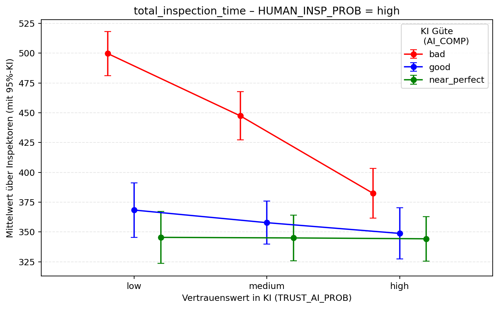 | 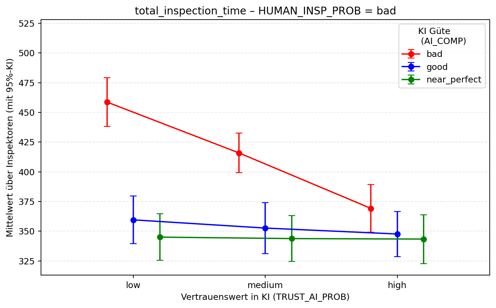 |
|:--:|:--:|
| *Gesamtbegutachtungszeit bei **hoher** menschlicher Güte: deutlicher Anstieg bei schwacher KI (rot) und geringem Vertrauen.* | *Gesamtbegutachtungszeit bei **schlechter** menschlicher Güte: Worst-Case-Konstellation mit dem stärksten Zeitaufschlag (~+60 %).* |

Die Subvariable `time_in_siding` spiegelt dieses Muster konsistent wider: Verschlechterungen bei KI **und** Mensch führen zu längeren Standzeiten im Gleis.

| 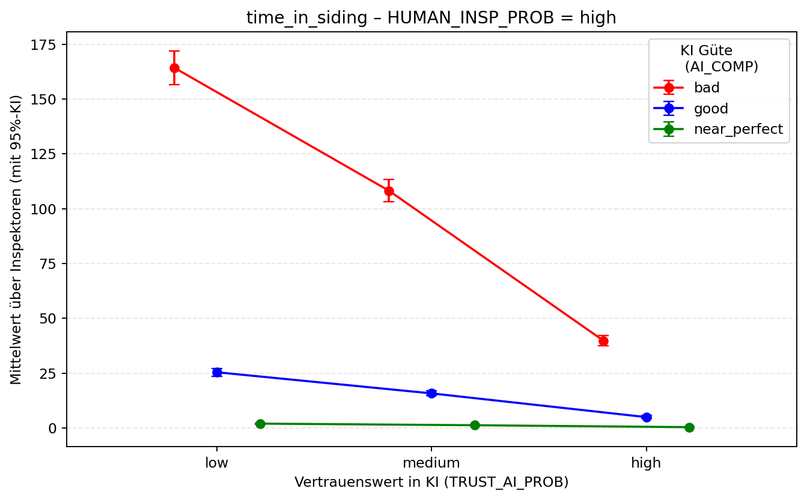 | 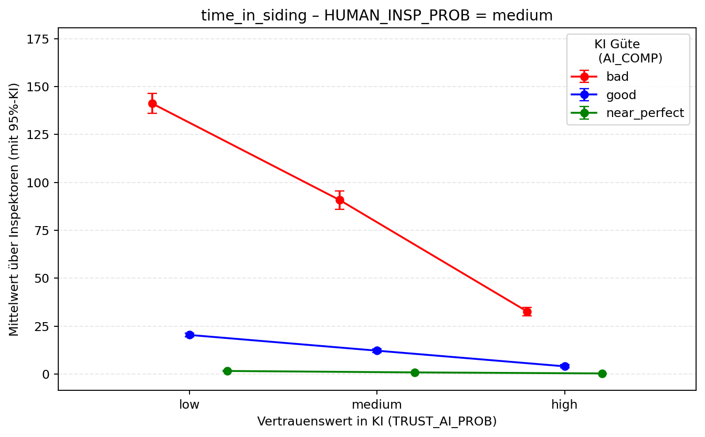 |
|:--:|:--:|
| *Zeit im Gleis (HUMAN = high): identisches Interaktionsmuster wie `total_inspection_time`.* | *Zeit im Gleis (HUMAN = medium): Übergangsbild zwischen hoher und schlechter menschlicher Güte.* |

### 3.3 Fehlerraten der KI — robust gegenüber Vertrauen, KI-güteabhängig

Die Raten `false_negatives_ai` und `false_positives_ai` verhalten sich **robust** gegenüber Variationen in Vertrauen und menschlicher Güte, hängen aber **stark von der KI-Güte** ab:

| KI-Güte | false negatives | false positives |
|---|---|---|
| schwach (bad) | ≈ 0,19 | ≈ 2,5 |
| gut (good) | < 0,1 | ≈ 0,3 |
| near_perfect | → ~0 | → ~0 |

| 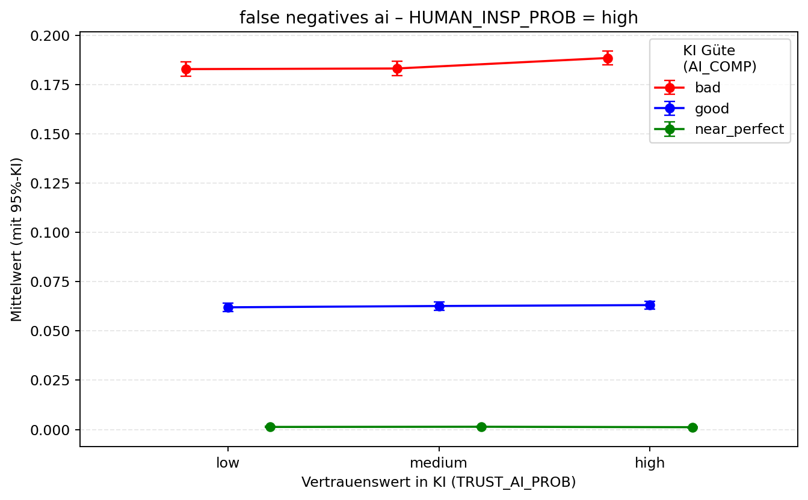 | 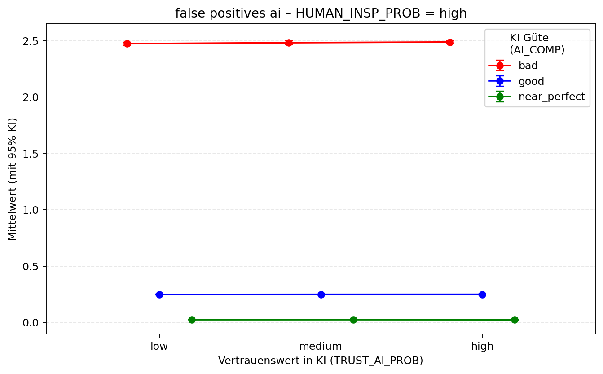 |
|:--:|:--:|
| *False Negatives der KI: nahezu flach über die Vertrauensstufen, getrennt allein durch die KI-Güte.* | *False Positives der KI: gleiche Charakteristik; schwache KI (rot) erzeugt deutlich mehr Fehlalarme.* |

Die durch die KI gefundenen wahren Schäden (`true_damages_found_ai`) bleiben annähernd **konstant** (≈ **1,0** bei schwacher, **1,17** bei guter, **1,2** bei near-perfect KI) — passend zur Annahme, dass die KI über alle Schadklassen hinweg detektiert, ihre Fehlklassifikationen aber mit der Güte variieren.

### 3.4 Menschliche Schadenerkennung — stärkste Interaktion

Die **stärkste Interaktion** zeigt sich bei `true_damages_found_human`:

- Bei **sehr guter** menschlicher Güte **konvergiert** die Leistung auf das Niveau der near-perfect KI (≈ **1,2** Schäden/Zug).
- Bei **schlechter** menschlicher Güte fällt die Entdeckungsrate **unter das Niveau einer schwachen KI** — ein Befund, der Kompetenzsicherung und Training unterstreicht.
- Trifft **schwache KI auf hohes Vertrauen**, sinkt selbst bei kompetenten Menschen die Zahl der gefundenen wahren Schäden. Dies deutet auf **automation bias** hin (übermäßige Relianz auf KI-Output, Unterkorrektur von Fehlern). Die Konstellation **„schwache KI × hohes Vertrauen“** ist damit die **riskanteste** für die diagnostische Qualität.

| 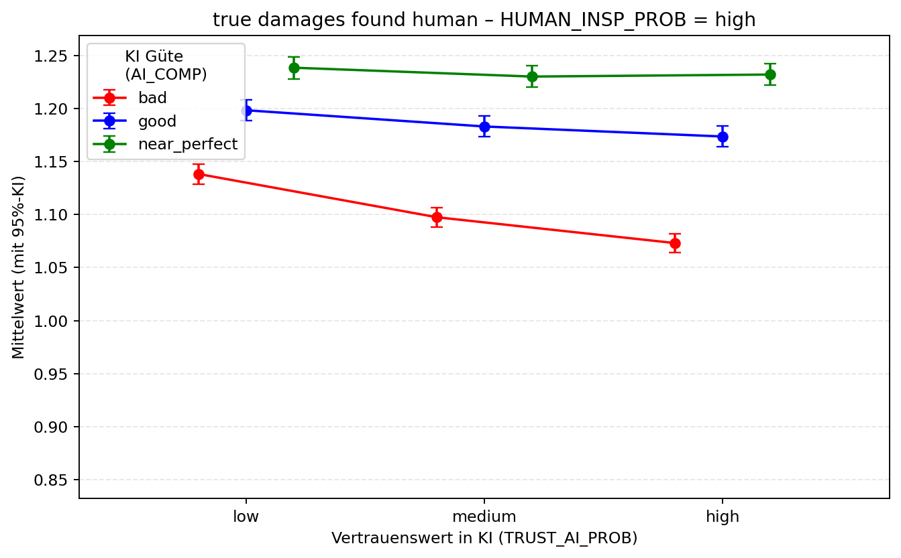 | 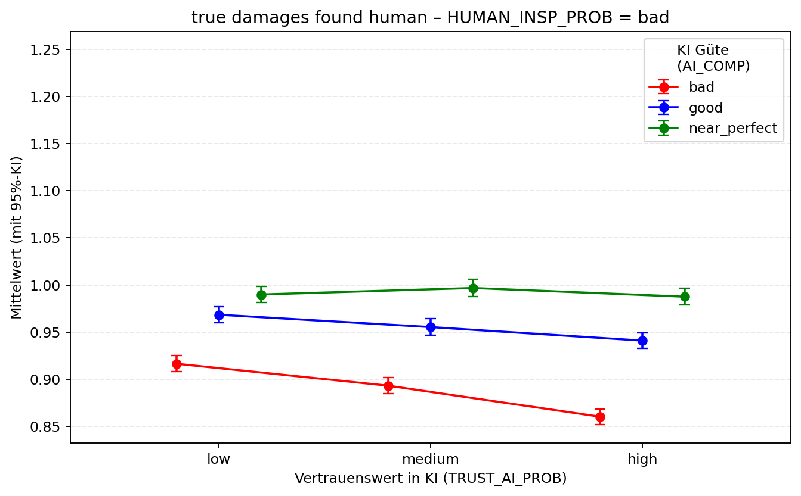 |
|:--:|:--:|
| *Menschliche Schadenerkennung bei **hoher** Güte: Konvergenz auf ≈ 1,2 Schäden/Zug; sichtbarer Abfall bei schwacher KI und hohem Vertrauen (automation bias).* | *Menschliche Schadenerkennung bei **schlechter** Güte: Entdeckungsrate unter dem Niveau schwacher KI.* |

Auch die Begutachtungszeit pro Zug (`time`) folgt dem Interaktionsmuster (Vertrauen × KI-Güte × menschliche Güte) und verliert mit near-perfect KI ihren prädiktiven Streubereich — die Prozesse werden homogen und vorhersagbar.

| 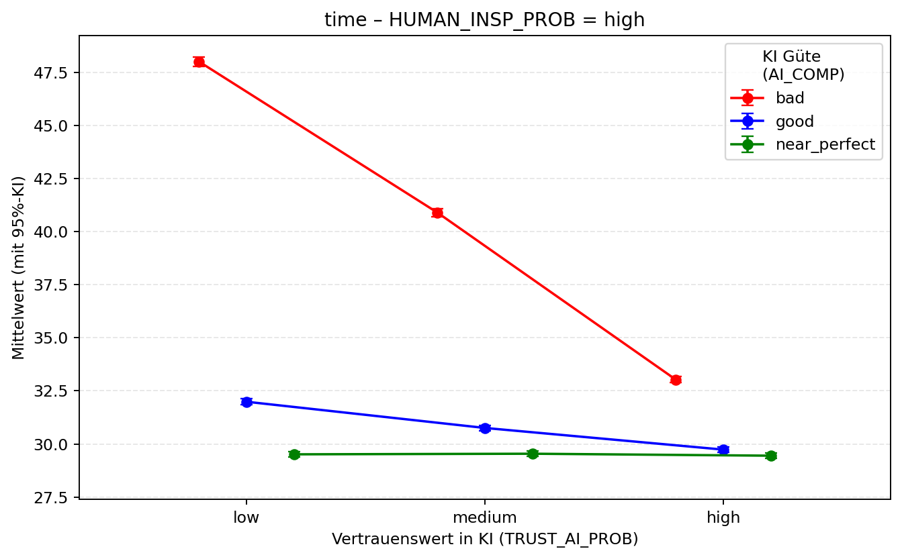 | 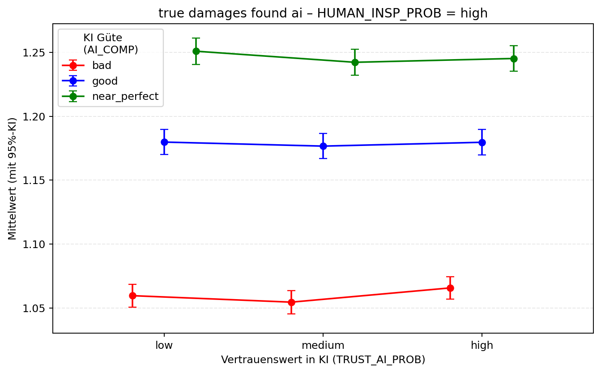 |
|:--:|:--:|
| *Aufenthaltszeit pro Zug: Interaktionsmuster kollabiert mit steigender KI-Güte (grün → schmaler Streubereich).* | *Durch die KI gefundene wahre Schäden: annähernd konstant je KI-Güte (≈ 1,0 / 1,17 / 1,2).* |

### 3.5 Drei erklärende Mechanismen

1. **Inkonsistenzkosten** — Jede Diskrepanz zwischen KI-Vorentscheidung und menschlicher Einschätzung erzeugt Prozessschleifen (Zusatzprüfungen, Rückfragen, Dokumentationsänderungen) und erhöht die Zeitkosten (`total_inspection_time`, `time_in_siding`).
2. **Kognitive Steuerung** — Niedriges Vertrauen bei schwacher KI fördert kritische Prüfung, erzeugt aber mehr Inkonsistenzen; hohes Vertrauen bei schwacher KI reduziert die Prüfungstiefe (automation bias) und kann diagnostische Fehlleistungen steigern.
3. **Kompetenzverstärkung** — Hohe menschliche Güte verbessert die Fehlererkennung und enttarnt Inkonsistenzen früher; kurzfristig erhöht das die Zeit, langfristig stabilisiert es die Qualitätskennzahlen.

**Fazit Studie 1:** Mit **steigender KI-Güte kollabieren die Interaktionen** — der Prozess wird deterministischer, und die Abhängigkeit von psychologischen Variablen (Vertrauen, menschliche Güte) nimmt ab.

---

## 4. Studie 2 — Ressourcenknappheit

In der zweiten Reihe wurden die infrastrukturellen Rahmenbedingungen gezielt verschärft (bei guter menschlicher Begutachtungsgüte; Variation von Vertrauen und KI-Güte):

| Größe | Veränderung |
|---|---|
| Gehzeiten | **+101 %** (verdoppelt) |
| Fahrzeiten | **+ ~83 %** |
| Frequenzierung | **+ ~32 %** (M = 72,24; SD = 0,68; Effektstärke **d = 0,22**) |

Trotz dieser Belastung zeigte sich das Gesamtsystem **bemerkenswert resilient** — unter bestimmten Konstellationen traten jedoch signifikante Effekte auf.

### 4.1 Effekte auf Prozesskennzahlen

Bei **schwacher KI-Güte + hohem Vertrauen** sank die Anzahl der begutachteten Züge von durchschnittlich **~18 auf ~15,5**. Parallel stiegen `time_in_siding` und die Gesamtbegutachtungszeit um **etwa +25 %**, was sich auch in einer verlängerten Begutachtungszeit pro Zug niederschlug. Die Umklassifikationsraten (`false_positives_umklassifiziert`, `false_negatives_umklassifiziert`) folgten diesem Muster und nahmen ebenfalls zu. Die KI-Güte selbst blieb unverändert — die Effekte resultieren primär aus der **Interaktion von Vertrauen und verschärften infrastrukturellen Bedingungen**.

| 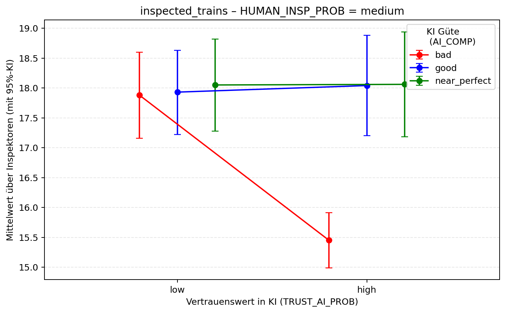 | 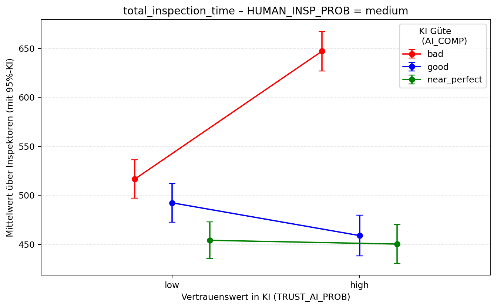 |
|:--:|:--:|
| *Begutachtete Züge unter Knappheit: Rückgang von ~18 auf ~15,5 bei schwacher KI und hohem Vertrauen.* | *Gesamtbegutachtungszeit unter Knappheit: ~+25 % in der kritischen Konstellation.* |

| 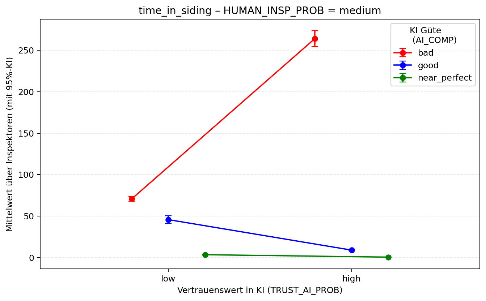 | 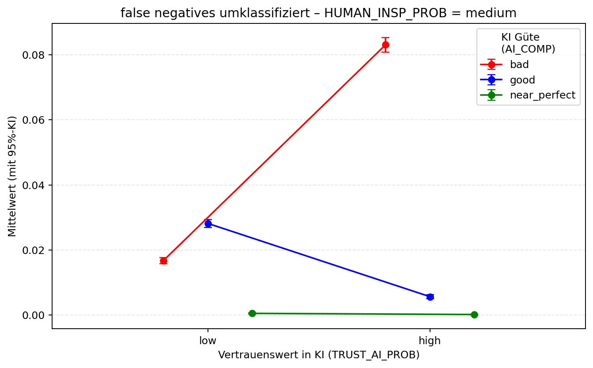 |
|:--:|:--:|
| *Zeit im Gleis unter Knappheit: ~+25 % in derselben Konstellation.* | *Umklassifizierte False Negatives: steigen unter Knappheit bei schwacher KI + hohem Vertrauen.* |

### 4.2 Qualitative Besonderheit — Vertrauenseffekt auf Schadenerkennung

Ein **unerwarteter Befund**: Unter Ressourcenknappheit **steigt** bei schlechter KI-Güte und hohem Vertrauen die Anzahl der vom Wagenmeister gefundenen wahren Schäden — **entgegengesetzt** zur stabilen Bedingung, wo dieselbe Konstellation die menschliche Leistung eher minderte. Dies deutet auf eine **adaptive Verhaltensänderung** hin: Erhöhte Belastung scheint eine **intensivere manuelle Kontrolle** auszulösen, wenn die KI als unsicher wahrgenommen wird, was die diagnostische Qualität verbessert.

| 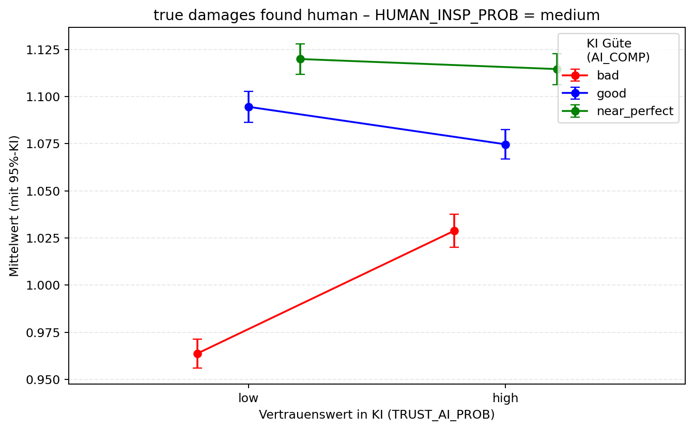 | 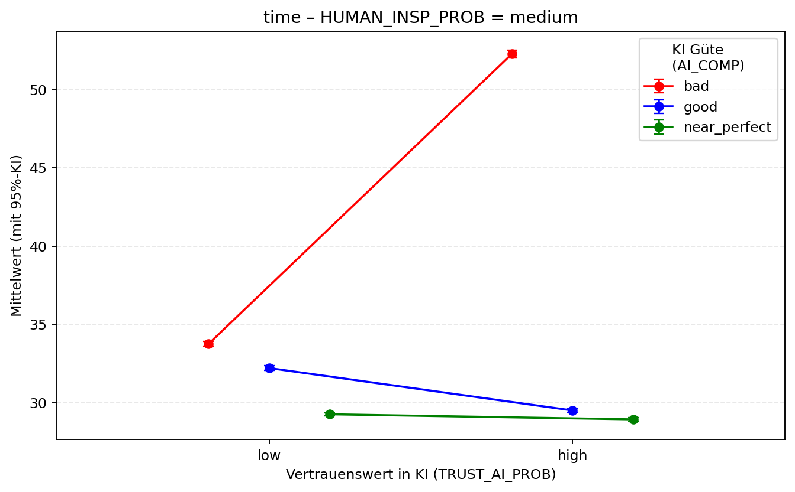 |
|:--:|:--:|
| *Vom Wagenmeister gefundene wahre Schäden unter Knappheit: gegenläufiger (adaptiver) Effekt zur stabilen Bedingung.* | *Aufenthaltszeit pro Zug unter Knappheit: erhöht in der kritischen Konstellation.* |

---

## 5. Limitationen und Ausblick

- **Reparaturprozesse und -kosten** sind im aktuellen Modell **noch nicht abgebildet**; sie sind als Erweiterung vorgesehen und würden die ökonomische Bewertung der Folgekosten (insbesondere von False Positives/Negatives) vervollständigen.
- **System-2-Komponente als Designhebel:** Eine längere digitale Begutachtungszeit kann elaboriertes, reflektiertes Denken (System 2) aktivieren, die Konsistenz zwischen KI-Vorentscheidung und menschlicher Schlussentscheidung erhöhen und so Inkonsistenzen reduzieren — ein Trade-off zwischen Zeit und Qualität, der sich gerade bei **schwacher KI-Güte und niedrigem Vertrauen** besonders auszahlen könnte.

---

## Zusammenfassung

Das Projekt ist **abgeschlossen**. Die Studie zeigt durchgängig: Die Effizienz und die diagnostische Genauigkeit des hybriden Begutachtungsprozesses werden maßgeblich durch das Zusammenspiel von **KI-Güte**, **Vertrauen** und **menschlicher Güte** bestimmt. Steigende KI-Güte macht den Prozess deterministisch und entkoppelt ihn von psychologischen Variablen; die riskanteste Konstellation ist **schwache KI × hohes Vertrauen** (automation bias). Unter Ressourcenknappheit bleibt das System resilient, zeigt aber eine bemerkenswerte **adaptive Umkehr** des Vertrauenseffekts auf die menschliche Schadenerkennung. Die vollständigen Plot-Sätze stehen in den oben verlinkten Ordnern zur Verfügung.
